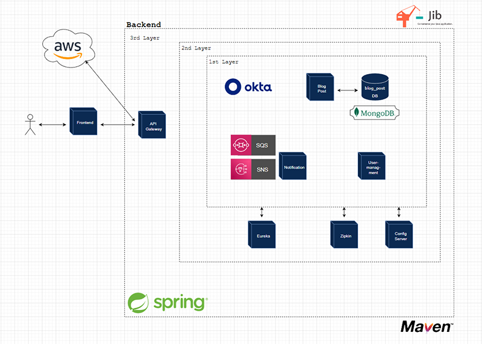
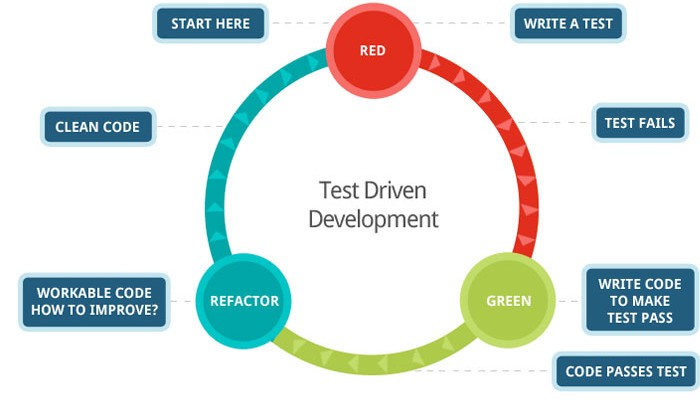
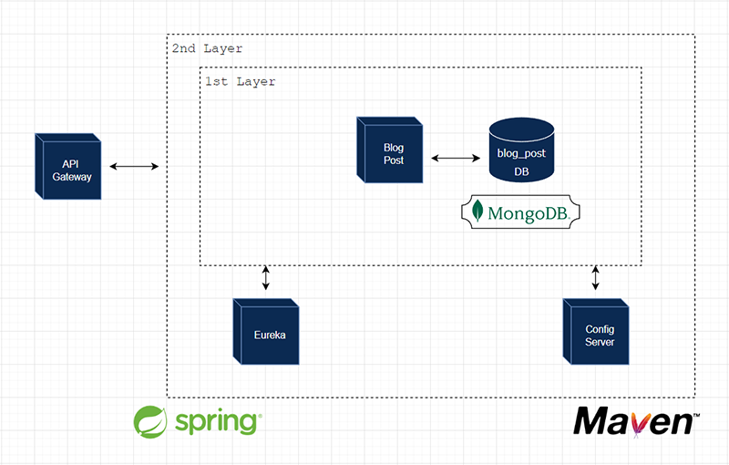

# 🍓 Jr. Portfolio-Microservice-Example 🍓

This Project demonstrates a simple example of a **"Microservice"** Pattern with ***"Spring Boot"*** and ***"Maven"***.
To implement security in this project, we will use **"Okta"** with a **"Jason Web Token (JWT)"** and an **"Opaque-Token"**. 
The idea is to create a **"blog-post"** service, where people can **CRUD** (*Create-Read-Update-Delete*) blog-post's. 
We connect this service to a **"NoSQL"** Database **"MongoDB"**. To play around with **"Amazon Webservices"**, 
we want to implement a small **"notification"** service with **"SNS"** and **"SQS"**, where a user can 
**"subscribe"** and **"publish"** messages to they subscribers.

> Note: You can import my Postman Collection to yours 

We'll have these endpoints...
    
    =============== BlogPost Service ===============

    POST     http://localhost:8765/api/v1/blogpost 
    GET      http://localhost:8765/api/v1/blogpost 
    GET      http://localhost:8765/api/v1/blogpost/filter 
    GET      http://localhost:8765/api/v1/blogpost/find 
    PUT      http://localhost:8765/api/v1/blogpost/update 
    DELETE   http://localhost:8765/api/v1/blogpost

    =============== Notification Service ===============

    GET      http://localhost:8765/api/v1/mail/subscribe
    GET      http://localhost:8765/api/v1/mail/publish

    =============== User-Management Service ===============

    GET      http://localhost:8765/api/v1/userdata

### We will use this Architecture to build our project...

Let's have a look to our Services...

## Blog Post Service 🍪

### Blogpost Service Model
    @Data
    @AllArgsConstructor
    @NoArgsConstructor
    @RequiredArgsConstructor
    @Document(collection = "blog_post")
    public class BlogPost {
        @Id
        private UUID id;
    
        @Size(min = 10, max = 40)
        @NotBlank(message = "Title can't be empty")
        private @NonNull String title;
    
        @Size(min = 20, max = 1000)
        @NotBlank(message = "Content can't be empty")
        private @NonNull String content;
    
        private String publishedAt;
    
        @Email(message = "Mail-Address invalid")
        private String creatorEmail;
        private Set<Tags> tags = new HashSet<>();
    }

### Dependencies 

Use Lombok, Devtools and Spring Validation to simplify the handling with the classes.

    <dependency>
        <groupId>org.projectlombok</groupId>
        <artifactId>lombok</artifactId>
        <optional>true</optional>
    </dependency>
    
    <dependency>
        <groupId>org.springframework.boot</groupId>
        <artifactId>spring-boot-devtools</artifactId>
        <scope>runtime</scope>
        <optional>true</optional>
    </dependency>
    
    <dependency>
        <groupId>org.springframework.boot</groupId>
        <artifactId>spring-boot-starter-validation</artifactId>
    </dependency>

Also, we need our MongoDB dependency in our non-blocking case...

    <dependency>
        <groupId>org.springframework.boot</groupId>
        <artifactId>spring-boot-starter-data-mongodb-reactive</artifactId>
    </dependency>

Don't forget to add also our Webflux dependency

    <dependency>
        <groupId>org.springframework.boot</groupId>
        <artifactId>spring-boot-starter-webflux</artifactId>
    </dependency>

Because we want to implement our Service to a discovery server in our case **"Eureka Server"**, 
we need the following dependency.

    <dependency>
        <groupId>org.springframework.cloud</groupId>
        <artifactId>spring-cloud-starter-netflix-eureka-client</artifactId>
    </dependency>

For our Testing purpose, we need also an additional tool, who makes TDD and BDD easier to read and write.

    <dependency>
        <groupId>org.assertj</groupId>
        <artifactId>assertj-core</artifactId>
        <version>{Use the Latest Version}</version> 
        <scope>test</scope>
    </dependency>

Now we have a good base to start...

### Configuration 

Add some properties to our <mark>**application.yml**</mark> file

> Note: Make sure you added a path to our **Database** MongoDB

    server:
        port: 8080

    spring:
        data:
            mongodb:
                uri: mongodb://localhost:27017/portfolio

### Records

Create also some **records** to retrieve only this information, what is really needed for our consumer...

For our normal Requests like to **create** a BlogPost use this...

    public record BlogPostRequest(String title,
                                  String content,
                                  String[] tags){}

For an **update**, we must specify the request a little more, so we create an extra record for that.

    public record BlogPostRequestUpdate(String oldTitle,
                                        String newTitle,
                                        String content,
                                        String[] tags) {}

When we get a response from our API, we would like to have our blog-post creators email address, 
for that we need a special record....

    public record BlogPostResponse(String title,
                                   String content,
                                   String email,
                                   String[] tags){}

### Repository

For our blog-post service we use this methodes....

    public interface IBlogPostRepository extends ReactiveMongoRepository<BlogPost, UUID> {
        Mono<BlogPost> findByTitleAndCreatorEmail(String title, String email);
        Mono<Boolean> existsBlogPostByTitleAndCreatorEmail(String title, String email);
        Mono<Void> deleteBlogPostByTitleAndCreatorEmail(String title, String email);
        Flux<BlogPost> findAllByTags(Set<Tags> tags);
    }
### Exception Handling

To create our own exceptions create a utils folder and place some exception case classes there.

For Bad Requests....

    @ResponseStatus(HttpStatus.BAD_REQUEST)
    public class BadRequestException extends RuntimeException{
        public BadRequestException(String message){
        super(message);
        }
    }

In Case of NoContent in our Database

    @ResponseStatus(HttpStatus.NO_CONTENT)
    public class NoContentException extends RuntimeException{
        public NoContentException(String message){
        super(message);
        }
    }

If we don't find what we are looking for create...

    @ResponseStatus(HttpStatus.NOT_FOUND)
    public class NotFoundException extends RuntimeException{
        public NotFoundException(String message){
        super(message);
        }
    }

> Note: If you like, create an enum with your messages

It could be something like this....

    public enum ExceptionResponse {
        BLOG_POST_NOT_FOUND,
        BLOG_POST_ALREADY_EXISTS,
        BLOG_POST_TAG_DOES_NOT_EXISTS,
        BLOG_POST_WITH_THESE_TAGS_NOT_FOUND,
        NO_CONTENT_IN_DB,
        REQUESTED_MODEL_INVALID,
        REQUESTED_MODEL_NOT_EXCEPTED,
        REQUEST_NOT_EXCEPTED
    }
### Other Utils

In this project we use a custom tool to show us the created Date.

    public interface IDateTimeCreator {
        @Bean
        static String createDateTime(){
            return LocalDateTime
            .now()
            .format(DateTimeFormatter.ofPattern("yyyy-MM-dd HH:mm:ss"));
        }
    }

***
##  Test Driven Development 🍪

What is it? And what can we expect from that approach?

Some Benefits of Test Driven Development (short TDD) :
+ Test Driven Development gives us a high code quality and confidence. 
+ Find bugs early in the development process
+ More consistent and accurate, than manually testing
+ They are fast!

> Note: Keep always your code readable!

> Note: When we write Unit Tests make sure that you keep the Tests isolated from the rest of the program.

With this Circle we can understand the logic a little bit more behind the idea...

### Laws of TDD 

+ § 1. You are not allowed to write any production code unless it is to make a failing unit test pass
+ § 2. You are not allowed to write any more of a unit test than is sufficient to fail and compilation
    failures are failures!
+ § 3. You are not allowed to write any more production code than is sufficient to pass the one failing unit test.

> Note: Don't forget to add **AssertJ** to our services. It helps us to write well organized and good tests!
***

## Continues Integration 🍪

For our CI Pipeline we'll use Semaphore. We want to test our application in an automatic way, before pushing
it into our master branch in our repository. The Benefit here, is that every change will trigger our configured 
pipeline, where our application will test some things. Shortly... "We check, if our new added code work's 
in our application."

> Note:  To see the more details, checkout the .semaphore folder there is a semaphore.yml file, 
> where we configure our pipeline...

***

### Test-Examples:

Here are a test cases example for our Repository....

        @Test
        @DisplayName("should retrieve BlogPost by findByTitleAndCreatorEmail() ")
        void should_retrieve_BlogPost_by_findByTitleAndCreatorEmail() {
            Mono<BlogPost> requestedBlogPost =
                    IBlogPostRepository.findByTitleAndCreatorEmail(
                            "The Weather Girls in New York City",
                            "soul-sisters@gmail.com");
    
            StepVerifier
                    .create(requestedBlogPost)
                    .assertNext(
                            check -> {
                                assertThat(check)
                                        .isNotNull();
                                assertThat(check.getTitle())
                                        .isEqualTo("The Weather Girls in New York City");
                                assertThat(check.getCreatorEmail())
                                        .isEqualTo("soul-sisters@gmail.com");
                            })
                    .verifyComplete();
    }

Here are a test cases example for our Service....

    @Test
    @DisplayName("should createBlockPost()")
    void should_createBlockPost() {
        given(blogPostRepository.existsBlogPostByTitleAndCreatorEmail(anyString(),anyString()))
        .willReturn(Mono.just(false));
        given(blogPostRepository.save(any()))
        .willReturn(Mono.just(blogPost));
    
            Mono<BlogPostResponse> requestedBlogPost =
                    blogPostService.createBlogPost(blogPostRequest,blogPost.getCreatorEmail());
    
            StepVerifier
                    .create(requestedBlogPost)
                    .assertNext(check -> {
                        assertThat(check.title())
                                .isEqualTo("This is the way");
                        assertThat(check.content())
                                .isEqualTo("A special sentence with force in it.");})
                    .verifyComplete();
    }

Here are a test cases example for our Controller....

    @Test
    @DisplayName("should getAllBlogPosts()")
    void should_getAllBlogPosts() {
        when(blogPostRepository.findAll())
                .thenReturn(Flux.just(blogPost));

        webTestClient
                .get()
                .uri(baseUrl)
                .exchange()
                .expectStatus()
                .isOk();

        verify(blogPostRepository,times(1))
                .findAll();
    }

More test scenarios and further details you can find in this repository....

### Service 

To handle our request well organized we create a Service-Interface and implement it to 
a class.

    public interface IBlogPostService {
        Mono<BlogPostResponse> createBlogPost(BlogPostRequest blogPostRequest, String email);
        Mono<BlogPostResponse> getBlogPostByTitleAndCreatorEmail(String title, String email);
        Flux<BlogPostResponse> getAllBlogPosts();
        Flux<BlogPostResponse> getAllBlogPostsWithTags(String[] tags);
        Mono<BlogPostResponse> updateBlogPost(BlogPostRequestUpdate blogPostRequest, String email);
        Mono<Void> deleteBlogPostByTitleAndCreatorEmail(String title, String email);
    }

Create a class BlogPostServiceImpl and implement the created Interface into our service.

    @Service
    @RequiredArgsConstructor
    public class BlogPostServiceImpl implements IBlogPostService {

        private final IBlogPostRepository blogPostRepository;
    
        @Override
        public Mono<BlogPostResponse> createBlogPost(BlogPostRequest blogPostRequest, String email) {
            return blogPostRepository
                    .existsBlogPostByTitleAndCreatorEmail(
                            blogPostRequest.title(),
                            email)
                    .flatMap(exists -> {
                        if(exists){
                            return Mono.error(
                                    new BadRequestException(valueOf(BLOG_POST_ALREADY_EXISTS)));
                        }
                        return blogPostRepository
                                .save(new BlogPost(
                                        UUID.randomUUID(),
                                        blogPostRequest.title(),
                                        blogPostRequest.content(),
                                        IDateTimeCreator.createDateTime(),
                                        email,
                                        stream(blogPostRequest.tags())
                                                .map(tags -> Tags.valueOf(tags.toUpperCase()))
                                                .collect(Collectors.toSet())))
                                .map(blogPost -> new BlogPostResponse(
                                        blogPost.getTitle(),
                                        blogPost.getContent(),
                                        email,
                                        blogPost.getTags().stream()
                                                .map(Enum::toString)
                                                .toArray(String[]::new)))
                                .switchIfEmpty(Mono.error(
                                        new BadRequestException(valueOf(REQUESTED_MODEL_INVALID))));
    
                    }).switchIfEmpty(Mono.error(
                            new BadRequestException(valueOf(REQUEST_NOT_EXCEPTED))));
        }
    
        @Override
        public Mono<BlogPostResponse> getBlogPostByTitleAndCreatorEmail(String title, String email) {
            return blogPostRepository
                    .existsBlogPostByTitleAndCreatorEmail(title,email)
                    .flatMap(exists -> {
                        if(!exists){
                            return Mono.error(
                                    new NotFoundException(valueOf(BLOG_POST_NOT_FOUND)));
                        }
                        return blogPostRepository
                                .findByTitleAndCreatorEmail(title,email)
                                .map(request -> new BlogPostResponse(
                                        request.getTitle(),
                                        request.getContent(),
                                        email,
                                        request.getTags().stream()
                                                .map(Enum::toString)
                                                .toArray(String[]::new)));
                    }).switchIfEmpty(Mono.error(
                            new BadRequestException(valueOf(REQUEST_NOT_EXCEPTED))));
        }
    
        @Override
        public Flux<BlogPostResponse> getAllBlogPosts() {
            return blogPostRepository
                    .findAll()
                    .map(blogPost -> new BlogPostResponse(
                            blogPost.getTitle(),
                            blogPost.getContent(),
                            blogPost.getCreatorEmail(),
                            blogPost.getTags().stream()
                                    .map(Enum::toString)
                                    .toArray(String[]::new)))
                    .switchIfEmpty(Mono.error(
                            new NoContentException(valueOf(NO_CONTENT_IN_DB))));
        }
    
        @Override
        public Flux<BlogPostResponse> getAllBlogPostsWithTags(String[] tags) {
            return blogPostRepository
                    .findAllByTags(stream(tags)
                            .map(mytags ->
                                    Tags.valueOf(mytags.toUpperCase()))
                            .collect(Collectors.toSet()))
                    .map(response -> new BlogPostResponse(
                            response.getTitle(),
                            response.getContent(),
                            response.getCreatorEmail(),
                            response.getTags().stream()
                                    .map(Enum::toString)
                                    .toArray(String[]::new)))
                    .switchIfEmpty(Mono.error(
                            new NotFoundException(valueOf(BLOG_POST_WITH_THESE_TAGS_NOT_FOUND))));
        }
    
        @Override
        public Mono<BlogPostResponse> updateBlogPost(BlogPostRequestUpdate blogPostRequest, String creatorEmail) {
            return blogPostRepository
                    .existsBlogPostByTitleAndCreatorEmail(
                            blogPostRequest.oldTitle(),
                            creatorEmail)
                    .flatMap(exists -> {
                        if (!exists){
                            return Mono.error(new BadRequestException(valueOf(BLOG_POST_NOT_FOUND)));
                        }
                        Mono<BlogPost> requestedBlogPost = blogPostRepository
                                .findByTitleAndCreatorEmail(
                                        blogPostRequest.oldTitle(),
                                        creatorEmail);
                        return requestedBlogPost
                                .flatMap(update -> {
                                    update.setTitle(blogPostRequest.newTitle());
                                    update.setContent(blogPostRequest.content());
                                    update.setPublishedAt(IDateTimeCreator.createDateTime());
                                    update.setTags(stream(blogPostRequest.tags())
                                            .map(request -> Tags.valueOf(request.toUpperCase()))
                                            .collect(Collectors.toSet()));
    
                                    return blogPostRepository
                                            .save(update)
                                            .map(response -> new BlogPostResponse(
                                                    response.getTitle(),
                                                    response.getContent(),
                                                    response.getCreatorEmail(),
                                                    response.getTags().stream()
                                                            .map(Enum::toString)
                                                            .toArray(String[]::new)));
                                });
                    });
        }
    
        @Override
        public Mono<Void> deleteBlogPostByTitleAndCreatorEmail(String title, String email) {
            return blogPostRepository
                    .existsBlogPostByTitleAndCreatorEmail(title,email)
                    .flatMap(exists -> {
                        if (!exists){
                            return Mono.error(
                                    new BadRequestException(valueOf(BLOG_POST_NOT_FOUND)));
                        }
                        return blogPostRepository
                                .deleteBlogPostByTitleAndCreatorEmail(title,email);
                    });
        }
    }

### Controller

To access to our API we need a RestController with some endpoints...

    @RestController
    @RequestMapping("/api/v1/blogpost")
    @RequiredArgsConstructor
    public class BlogPostController {

        private final BlogPostServiceImpl blogPostServiceImpl;
    
        @PostMapping
        @ResponseStatus(HttpStatus.CREATED)
        public Mono<BlogPostResponse> createBlogPost(
                                            @RequestBody BlogPostRequest blogPostRequest,
                                            @RequestParam String creatorEmail){
           return blogPostServiceImpl.createBlogPost(blogPostRequest,creatorEmail);
        }

        @GetMapping("/find")
        @ResponseStatus(HttpStatus.OK)
        public Mono<BlogPostResponse> getBlogPostByTitleAndCreatorEmail(
                                            @RequestParam String title,
                                            @RequestParam String creatorEmail){
            return blogPostServiceImpl.getBlogPostByTitleAndCreatorEmail(title,creatorEmail);
        }

        @GetMapping
        @ResponseStatus(HttpStatus.OK)
        public Flux<BlogPostResponse> getAllBlogPosts(){
            return blogPostServiceImpl.getAllBlogPosts();
        }
    
        @GetMapping("/filter")
        @ResponseStatus(HttpStatus.OK)
        public Flux<BlogPostResponse> getBlogPostByTags(@RequestParam String[] tags){
            return blogPostServiceImpl.getAllBlogPostsWithTags(tags);
        }

        @PutMapping("/update")
        @ResponseStatus(HttpStatus.OK)
        public Mono<BlogPostResponse> updateBlogPost(
                                            @RequestBody BlogPostRequestUpdate blogPostRequest,
                                            @RequestParam String creatorEmail){
            return blogPostServiceImpl.updateBlogPost(blogPostRequest,creatorEmail);
        }

        @DeleteMapping
        @ResponseStatus(HttpStatus.NO_CONTENT)
        public Mono<Void> deleteBlogPostByTitleAndCreatorEmail(
                                            @RequestParam String title,
                                            @RequestParam String creatorEmail){
            return blogPostServiceImpl.deleteBlogPostByTitleAndCreatorEmail(title,creatorEmail);
        }
    }

## Discovery Server 🍪

To register our services we need a Discovery-Server. In our case we'll use Eureka-Server.

Create a new Service with the following dependency

### Dependencies

    <dependency>
        <groupId>org.springframework.cloud</groupId>
        <artifactId>spring-cloud-starter-netflix-eureka-server</artifactId>
    </dependency>

### Main-class
Make sure you added **"@EnableEurekaServer"**...

    @EnableEurekaServer
    @SpringBootApplication
    public class EurekaServerApplication {
    
        public static void main(String[] args) {
            SpringApplication.run(EurekaServerApplication.class, args);
        }
    
    }

add the following properties to your Eureka application.yml file...

    server:
        port: 8761
    
    eureka:
        client:
        register-with-eureka: false
        fetch-registry: false

and to our **blog-post** service application.yml file...

    eureka:
        client:
            service-url:
                defaultZone: http://localhost:8761/eureka
        instance:
            instance-id: ${spring.application.name}:${random.uuid}

We also **"@EnableEurekaClient"** to our **"blog-post"** service...

    @EnableEurekaClient
    @SpringBootApplication
    public class BlogPostApplication {
        public static void main(String[] args) {
            SpringApplication.run(BlogPostApplication.class, args);
        }
    }

> Note: You can run the two services and have a look on http://localhost:8761/eureka , if the registry is working.

## API Gateway 🍪

After we created our **"blog-post"** service and **"eureka-server"**, we'll create a gateway to unify our ports.
For that we choose the port http://localhost:8765 ....

### Dependencies

    <dependency>
        <groupId>org.springframework.cloud</groupId>
        <artifactId>spring-cloud-starter-gateway</artifactId>
    </dependency>

    <dependency>
        <groupId>org.springframework.cloud</groupId>
        <artifactId>spring-cloud-starter-netflix-eureka-client</artifactId>
    </dependency>

    <dependency>
        <groupId>org.springframework.boot</groupId>
        <artifactId>spring-boot-starter-webflux</artifactId>
    </dependency>

> Note: You can also add some tools like lombok or devtools to each service...

### Configuration
Add some properties to our <mark>**application.yml**</mark> file...

    server:
        port: 8765

    spring:
        cloud:
            gateway:
                discovery:
                    locator:
                        enabled: true
                routes:
                    - id: BlogPostController
                      uri: lb://blog-post
                      predicates:
                        - Path=/api/v1/blogpost**
                        - Path=/api/v1/blogpost/**
    eureka:
        client:
            service-url:
                defaultZone: http://localhost:8761/eureka

Make sure that you also added **"@EnableEurekaClient"** ....

    @EnableEurekaClient
    @SpringBootApplication
    public class ApiGatewayApplication {
    
        public static void main(String[] args) {
            SpringApplication.run(ApiGatewayApplication.class, args);
        }
    
    }

> Note: Now we can reach our blog-post service on http://localhost:8765/api/v1/blogpost

## Config Server 🍪

To keep our <mark>**application.yml**</mark> files well organized, we use a **Config-Server**. By adding a **Config Server** to
our **Microservice**, our services will fetch the needed **application.yml** files to they service.

### Dependencies
We only need one dependency here...

    <dependency>
        <groupId>org.springframework.cloud</groupId>
        <artifactId>spring-cloud-config-server</artifactId>
    </dependency>

### Main-Class
Don't forget to add **"@EnableConfigServer"** to the Main-Class

    @EnableConfigServer
    @SpringBootApplication
    public class ConfigServerApplication {
        public static void main(String[] args) {
            SpringApplication.run(ConfigServerApplication.class, args);
        }
    }

### Config Folder
Create a **config** folder in the **resources** folder and refactor the "application.yml" files to this folder. 
Make sure you **rename** the application.yml files and the name matches the service like ->  **api-gateway.yml**

### More Dependencies for our Services
Add the following dependency to our services (blog-post,eureka and api-gateway)...

    <dependency>
        <groupId>org.springframework.cloud</groupId>
        <artifactId>spring-cloud-starter-config</artifactId>
    </dependency>

## Short Overview what we already created... 🍪

Now we've created already successfully a **Microservice**. To make it more **interesting** and make it **save**,
we'll extend it ! This is a big benefit of a **Microservice-Architecture** rather than a Monolithic-Architecture.
We can easily extend our **Microservice**, by just adding more services to our **Discovery-Server**.

## Notification Service 🍪

Now we want to create an Amazon Simple Notification Service ([Aws SNS](https://aws.amazon.com/de/sns/)) 
and connect it to an Amazon Simple Queue Service ([Aws SQS](https://aws.amazon.com/de/sqs/)). 
We need also the AWS Identity and Access Management ([Aws IAM](https://aws.amazon.com/de/iam/)).

### Dependencies

For accessing our AWS we need the following dependency

    <dependency>
        <groupId>org.springframework.cloud</groupId>
        <artifactId>spring-cloud-starter-aws-messaging</artifactId>
        <version>2.2.5.RELEASE</version>
    </dependency>

Other dependencies what we needed. To keep it simple we add our tools Lombok and so on.

    <dependency>
        <groupId>org.springframework.cloud</groupId>
        <artifactId>spring-cloud-starter-netflix-eureka-client</artifactId>
    </dependency>
    <dependency>
        <groupId>org.springframework.cloud</groupId>
        <artifactId>spring-cloud-starter-config</artifactId>
    </dependency>

### Configuration

Add to the <mark>application.yml</mark> file the following dependency... 

    server:
        port: 0

    cloud:
        aws:
            region:
                static: eu-central-1
                auto: false
            stack:
                auto: false
            credentials:
                access-key: ${AWS_ACCESS_KEY}
                secret-key: ${AWS_SECRET_KEY}
            sns:
                topic:
                    interviewStatus: 
                        arn: ${AWS_SNS_ARN}
        
    eureka:
        client:
            service-url:
                defaultZone: http://localhost:8761/eureka
        instance:
            instance-id: ${spring.application.name}:${random.uuid}
        
    logging:
        level:
            com:
                amazonaws:
                    util:
                        EC2MetadataUtils: error
                        internal:
                            InstanceMetadataServiceResourceFetcher: error

You need to specify again the **Route** to access it with http://localhost:8765

    routes:
        ....
        - id: NotificationController
          uri: lb://notification
          predicates:
            - Path=/api/v1/mail/**

### NotificationConfig class

Create a NotificationConfig class to configure our service. 

    @Configuration
    public class NotificationConfig {

        @Value("${cloud.aws.credentials.access-key}")
        private String accessKey;
        @Value("${cloud.aws.credentials.secret-key}")
        private String secretKey;
        @Value("${cloud.aws.region.static}")
        private String region;
    
    
        public AmazonSQSAsync amazonSQSAsync() {
            BasicAWSCredentials credentials = new BasicAWSCredentials(accessKey,secretKey);
    
            return AmazonSQSAsyncClientBuilder
                    .standard()
                    .withRegion(region)
                    .withCredentials(new AWSStaticCredentialsProvider(credentials))
                    .build();
        }
    
        @Bean
        public QueueMessagingTemplate queueMessagingTemplate(){
            return new QueueMessagingTemplate(amazonSQSAsync());
        }
    }

### Controller

Create a NotificationController class to talk to our services on Amazon.

    @RestController
    @RequestMapping("/api/v1/mail")
    @RequiredArgsConstructor
    public class NotificationController {

        @Value("${cloud.aws.sns.topic.interviewStatus.arn}")
        private String topicArn;

        private final AmazonSNSClient snsClient;

        @GetMapping("/subscribe")
        public Mono<String> addSubscription(@RequestParam String email){
            SubscribeRequest request =
                    new SubscribeRequest(topicArn,"email",email);
            snsClient.subscribe(request);
            return Mono.just("check your emails !");
        }
        
        @GetMapping("/publish")
        public Mono<String> publishMessageToTopic(@RequestParam String message){
            PublishRequest publishRequest =
                    new PublishRequest(topicArn,message, "****A new Blogpost was published****");
            snsClient.publish(publishRequest);
            return Mono.just("message successfully published");
        }
        
        @SqsListener(value = "Receiver", deletionPolicy = SqsMessageDeletionPolicy.ON_SUCCESS)
        public void receiveSuccess(String message){
            log.info("Message received {}",message);
        }
    }

### Main class

Don't forget to add the annotation **"@EnableEurekaClient"** to the Notification-Main class.

    @EnableEurekaClient
    @SpringBootApplication
    public class NotificationApplication {
        public static void main(String[] args) {
            SpringApplication.run(NotificationApplication.class, args);
        }
    }

## Distributed Tracing  🍪

To measure our service's performance, we use a simple service called "Zipkin". 

### Dependencies

We need to add two dependencies in each service 

    <dependency>
        <groupId>org.springframework.cloud</groupId>
        <artifactId>spring-cloud-starter-sleuth</artifactId>
    </dependency>
    <dependency>
        <groupId>org.springframework.cloud</groupId>
        <artifactId>spring-cloud-sleuth-zipkin</artifactId>
    </dependency>

### Push Zipkin Container

Push the following Container from [Dockerhub](https://hub.docker.com/) to our Docker environment...

Just use this command:

    docker pull openzipkin/zipkin

### Configuration

Add the following properties to each .yml file...

    sleuth:
        sampler:
          probability: 1.0
    zipkin:
        baseUrl: http://localhost:9411/

> Note: We can reach our Zipkin service under http://localhost:9411/

## Okta 🍪

Use the Okta Cli and use the following command...

> Note: Make sure you are registered to Okta Dev Webapps, if not you can use "okta register" command

> Note: Make sure you are logged into the Okta environment, we can check it under "okta login"

    okta apps create

+ Name "portfolio" 
+ Chose Option 1 for Web
+ Chose Option 2 for Spring boot 
+ Leave for now the default Redirects.

> Note: Don't forget to add our "Trusted Origin" in our Security -> API -> "Trusted Origin" 
> http://localhost:8765 and http://localhost:8080 enable also CORS.

We will use the Client Id, Client Secret and Client Issuer later in our services...

## User-Management Service 🍪

We would like to have a small service, where we authenticate us with OpenID-Connect. We will get
a Jason Web Token with that we are authenticated and can have access to our endpoints. 
So let's create a new service...

### Dependencies

This is our Okta dependency

    <dependency>
        <groupId>com.okta.spring</groupId>
        <artifactId>okta-spring-boot-starter</artifactId>
        <version>2.1.5</version>
    </dependency>

Add also
    
     <dependency>
        <groupId>org.springframework.boot</groupId>
        <artifactId>spring-boot-starter-webflux</artifactId>
    </dependency>
    <dependency>
        <groupId>org.springframework.cloud</groupId>
        <artifactId>spring-cloud-starter-netflix-eureka-client</artifactId>
    </dependency>
    <dependency>
        <groupId>org.springframework.cloud</groupId>
        <artifactId>spring-cloud-starter-config</artifactId>
    </dependency>
     <dependency>
        <groupId>org.springframework.cloud</groupId>
        <artifactId>spring-cloud-sleuth-zipkin</artifactId>
    </dependency>
    <dependency>
        <groupId>org.springframework.cloud</groupId>
        <artifactId>spring-cloud-starter-sleuth</artifactId>
    </dependency>

And some tools Lombok and so on.

### Configuration

For our .yml file, we need now some special properties...

    okta:
        oauth2:
            issuer: ${OKTA_ISSUER}
            client-id: ${OKTA_CLIENT_ID}
            client-secret: ${OKTA_CLIENT_SECRET}
            scopes: openid, profile, email

### SecurityConfiguration class

Create a Security Configuration class to this service.

    @EnableWebFluxSecurity
    @EnableGlobalMethodSecurity(prePostEnabled = true)
    public class UserManagementSecurity {
        @Bean
        public SecurityWebFilterChain securityWebFilterChain(ServerHttpSecurity http){
            http
                .csrf().disable()
                .authorizeExchange()
                .anyExchange()
                .authenticated()
                .and().oauth2Login()
                .and().oauth2ResourceServer().jwt();
                return http.build();
        }
    }

### Model

Create a Simple "MyUser" Model-Class

    @Data
    public class MyUser {
        private String userName;
        private String email;
        private String idToken;
        private String accessToken;
    }

### Controller

Creat a RestController to communicate with our API and Okta.

    @RestController
    @RequestMapping("/api/v1/userdata")
    public class UserManagementController {
    
        @GetMapping
        public Mono<MyUser> userdata(@AuthenticationPrincipal OidcUser oidcUser,
                                    @RegisteredOAuth2AuthorizedClient("okta")OAuth2AuthorizedClient client){
    
            MyUser myUser = new MyUser();
    
            myUser.setUserName(oidcUser.getFullName());
            myUser.setEmail(oidcUser.getEmail());
            myUser.setIdToken(oidcUser.getIdToken().getTokenValue());
            myUser.setAccessToken(client.getAccessToken().getTokenValue());
            return Mono.just(myUser);
        }
    
        @GetMapping("/email")
        public Mono<String> currentEmail(@AuthenticationPrincipal OidcUser oidcUser){
            return Mono.just(oidcUser.getEmail());
        }
    }

> Note: Don't forget to write some tests for the classes.

### Main class

Also make sure you configured again our Main-Class by annotating "@EnableEurekaClient"
    
    @EnableEurekaClient
    @SpringBootApplication
    public class UsermanagementApplication {
        public static void main(String[] args) {
            SpringApplication.run(UsermanagementApplication.class, args);
        }
    }

You need to specify again the **Route** to access it with http://localhost:8765

    routes:
        ....
        - id: UserManagementController
          uri: lb://user-management
          predicates:
             - Path=/api/v1/userdata**

When we now start our server and try to access http://localhost:8765/api/v1/userdata we will directly 
redirect to okta login page. In our case we already created a "John Doe" with the username/email "test@example.com" 
our password will be "12345678!". So let's login...

If it's working you will receive a json body back with

    {
        "userName": "John Doe",
        "email": "test@example.com",
        "idToken": "${OKTA_ID_TOKEN}",
        "accessToken": "${OKTA_ACCESS_TOKEN}"
    }

## Add Security to Blog Post and Notification service 🍪

Now we want to secure our **"blogpost"** and **"notification"** service in our Microservice. We don't need any 
user information directly, so we'll handle our secure request via **"Opaque-Token"** . With that "Opaque-Token" 
we must authorize us for each request, rather than a "Jason Web Token" (short JWT), but It's more safe because that Token
doesn't contain any critical User-Information. Let's create...

More Information we can find in the Spring Documentation.

[OAuth 2.0 Resource Server Opaque Token](https://docs.spring.io/spring-security/reference/reactive/oauth2/resource-server/opaque-token.html)

Add also the following Redirects to our Okta app 

    http://localhost:8765/login
    http://localhost:8080/login
    http://localhost:1997/login
    http://localhost:8765/login/oauth2/code/okta
    http://localhost:8080/login/oauth2/code/okta
    http://localhost:1997/login/oauth2/code/okta
    http://localhost:8765/authorization-code/callback
    http://localhost:8080/authorization-code/callback
    http://localhost:1997/authorization-code/callback
    http://localhost:8765/oauth2/default/v1/introspect
    http://localhost:8080/oauth2/default/v1/introspect
    http://localhost:1997/oauth2/default/v1/introspect

### Dependency

We need to implement the following Dependencies...

    <dependency>
        <groupId>org.springframework.boot</groupId>
        <artifactId>spring-boot-starter-oauth2-resource-server</artifactId>
    </dependency>
    <dependency>
        <groupId>com.nimbusds</groupId>
        <artifactId>oauth2-oidc-sdk</artifactId>
        <version>9.35</version>
        <scope>runtime</scope>
    </dependency>

Our **"Blogpost"** and **"Notification"** service, will now serve as a **"Resource Server"**, and it's dependent 
from the **"Authorization Server"**. 

### Configuration

Add these properties to our <mark>.yml</mark>-files.

    security:
        oauth2:
         resourceserver:
            opaque-token:
            introspection-uri: ${OKTA_INTROSPECTION-URI}
            client-id: ${OKTA_CLIENT_ID}
            client-secret: ${OKTA_CLIENT_SECRET}

### JwtOpaqueToken

Create the following class to handle the Token verification. 
Resource from "[Better Testing with Spring Security Test](https://developer.okta.com/blog/2021/05/19/spring-security-testing)"

    public class JwtOpaqueTokenIntrospector implements ReactiveOpaqueTokenIntrospector {
        @Autowired
        private OAuth2ResourceServerProperties oAuth2;
        private ReactiveOpaqueTokenIntrospector delegate;
    
        // Use PostConstruct to inject the needed dependencies before the Constructor
        @PostConstruct
        private void setUp() {
            delegate =
                    new NimbusReactiveOpaqueTokenIntrospector(
                            oAuth2.getOpaquetoken().getIntrospectionUri(),
                            oAuth2.getOpaquetoken().getClientId(),
                            oAuth2.getOpaquetoken().getClientSecret());
        }
    
        public Mono<OAuth2AuthenticatedPrincipal> introspect(String token) {
            return delegate
                    .introspect(token)
                    .flatMap(principal -> enhance(principal));
        }
    
        private Mono<OAuth2AuthenticatedPrincipal> enhance(OAuth2AuthenticatedPrincipal principal) {
            // Saves all Authorities from our Principal in a collection...
            Collection<GrantedAuthority> authorities = extractAuthorities(principal);
    
            OAuth2AuthenticatedPrincipal enhanced =
                    new DefaultOAuth2AuthenticatedPrincipal(
                            principal.getAttributes(), authorities);
    
            return Mono.just(enhanced);
        }
    
        private Collection<GrantedAuthority> extractAuthorities(OAuth2AuthenticatedPrincipal principal) {
    
            Collection<GrantedAuthority> authorities =
                    new ArrayList<>(principal.getAuthorities());
    
            List<String> groups = principal.getAttribute("groups");
    
            if (groups != null) {
                groups.stream()
                        .map(SimpleGrantedAuthority::new)
                        .forEach(authorities::add);
            }
    
            return authorities;
        }
    }

Now let's create a Configuration-Class...

    @EnableWebFluxSecurity
    @EnableReactiveMethodSecurity
    public class BlogPostSecurityConfig implements WebFluxConfigurer {
        @Bean
        public SecurityWebFilterChain securityWebFilterChain(ServerHttpSecurity http) {
            return http.csrf().disable()
                        .authorizeExchange()
                        .anyExchange().authenticated()
                        .and()
                        .oauth2ResourceServer()
                        .opaqueToken().and().and().build();
        }
        
        @Bean
        public ReactiveOpaqueTokenIntrospector introspector() {
            return new JwtOpaqueTokenIntrospector();
        }

    }
## Build Docker Image with Jib

To simplify the process of building a docker Image, we will use a maven plugin "Jib" 

### Plugin 

Add the following plugin to each service

    <plugin>
        <groupId>com.google.cloud.tools</groupId>
        <artifactId>jib-maven-plugin</artifactId>
        <version>3.2.1</version>
        <configuration>
            <to>
                <image>${Service Name}</image>
            </to>
        </configuration>
    </plugin>

### Docker Image

Use the following command on each service to build a docker image.

    mvn clean install jib:dockerBuild

## Docker Compose 🍪

After we created successfully a docker Image of each service we'll now compose it 
So create a <mark>docker-compose.yml</mark>-file to containerize our microservice.

    version: '3.9'

    services:
    #<========== Gateway ==========>
        api-gateway:
            build: .
            image: api-gateway:latest
            container_name: api-gateway_container
            mem_reservation: 700m
            ports:
                 - "8765:8765"
            networks:
                - portfolio
            depends_on:
                - config-server
                - eureka-server
            environment:
                - eureka.client.serviceurl.defaultzone=http://eureka-server:8761/eureka
                - spring.zipkin.base-url=http://zipkin-server:9411
    #<========== BlogPost ==========>
        blog-post:
            build: .
            image: blog-post:latest
            container_name: blog-post_container
            mem_reservation: 700m
            ports:
                - "8080:8080"
            networks:
                - portfolio
            depends_on:
                - config-server
                - eureka-server
                - mongo
            environment:
                - eureka.client.serviceurl.defaultzone=http://eureka-server:8761/eureka
                - spring.zipkin.base-url=http://zipkin-server:9411
                - spring.data.mongodb.uri=mongodb://mongo:27017/portfolio
    #<========== Notification ==========>
        notification:
            build: .
            image: notification:latest
            container_name: notification_container
            mem_reservation: 700m # Memories limit
            ports:
                - "8081:8081"
            networks:
                - portfolio
            depends_on:
                - config-server
                - eureka-server
                - api-gateway
            environment:
                - eureka.client.serviceurl.defaultzone=http://eureka-server:8761/eureka
                - spring.zipkin.base-url=http://zipkin-server:9411
    #<========== User-Management ==========>
        user-management:
            build: .
            image: user-management:latest
            container_name: user-management_container
            mem_reservation: 700m # Memories limit
            ports:
                - "1997:1997"
            networks:
                - portfolio
            depends_on:
                - config-server
                - eureka-server
                - api-gateway
            environment:
                - eureka.client.serviceurl.defaultzone=http://eureka-server:8761/eureka
                - spring.zipkin.base-url=http://zipkin-server:9411
    #<========== Mongo ==========>
        mongo:
            build: .
            image: mongo:latest
            container_name: mongo_container
            restart: always
            environment:
                MONGO_INITDB_DATABASE: portfolio
            volumes:
                - mongodb_data_container:/data/db
            networks:
                - portfolio
            ports:
                - "27017:27017"
    #<========== Server ==========>
    #<- Eureka ->
        eureka-server:
            build: .
            image: eureka-server:latest
            container_name: eureka-server_container
            mem_reservation: 700m # Memories limit
            depends_on:
                - config-server
            ports:
                - "8761:8761"
            networks:
                - portfolio
    #<- Config ->
        config-server:
            build: .
            image: config-server:latest
            container_name: config-server_container
            mem_reservation: 300m
            ports:
                - "8888:8888"
            networks:
                - portfolio
    #<========== Zipkin ==========>
        zipkin-server:
            build: .
            image: openzipkin/zipkin:latest
            mem_reservation: 300m
            container_name: zipkin_container
            ports:
                - "9411:9411"
            networks:
                - portfolio
            restart: on-failure
    #<========== Swagger UI ==========>
        swagger-ui:
            build: .
            image: swaggerapi/swagger-ui:latest
            mem_reservation: 700m
            container_name: swagger-ui_container
            ports:
                - "9999:9999"
            depends_on:
                - api-gateway
            networks:
                - portfolio

    networks:
        portfolio:

    volumes:
        mongodb_data_container:

## Resources 🍪

**Spring Boot Docs**
+ [Spring Boot Documentation 8.2. Reactive Web Applications](https://docs.spring.io/spring-boot/docs/current/reference/htmlsingle/#web.reactive)
+ [OAuth 2.0 Resource Server Opaque Token](https://docs.spring.io/spring-security/reference/reactive/oauth2/resource-server/opaque-token.html)

**Amazon Web Services**
+ [Aws SQS](https://aws.amazon.com/de/sqs/)
+ [Aws SNS](https://aws.amazon.com/de/sns/)

**Okta Blog:**
+ [Better Testing with Spring Security Test](https://developer.okta.com/blog/2021/05/19/spring-security-testing)
+ [OAuth 2.0 Patterns with Spring Cloud Gateway](https://developer.okta.com/blog/2020/08/14/spring-gateway-patterns)

**Other**
+ [Microservices API Documentation with Springdoc OpenAPI](https://piotrminkowski.com/2020/02/20/microservices-api-documentation-with-springdoc-openapi/)
